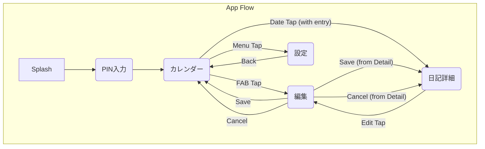

# MyDiary アプリ 設計書

## 1. 概要

本ドキュメントは、日記アプリ「MyDiary」の設計について記述します。
要件定義書 ([doc/RequirementDefinition.md](./RequirementDefinition.md)) および技術スタック ([doc/TECH_STACK.md](./TECH_STACK.md)) に基づき、アプリのアーキテクチャ、画面設計、データモデル、およびその他の技術的詳細を定義します。

**目的:** 日々の出来事や感情を簡単に記録・管理できるシンプルな日記アプリを開発する。
**ターゲット:** 日記習慣を身につけたい20-30代

## 2. 用語定義

*   **日記エントリー:** ユーザーが記録する個々の日記データ (タイトル、本文、日付、気分、天気などを含む)
*   **PIN:** Personal Identification Number (4桁の数字)
*   **KMP:** Kotlin Multiplatform
*   **MVVM:** Model-View-ViewModel アーキテクチャパターン
*   **Room:** Android Jetpack の永続化ライブラリ (ローカルデータベース)
*   **Compose:** Android の宣言的 UI ツールキット

## 3. アーキテクチャ

### 3.1. 全体像

*   **プラットフォーム:** Android ネイティブ (Kotlin), KMP (一部ロジック共有)
*   **アーキテクチャパターン:** MVVM (Model-View-ViewModel) を採用
    *   **View:** Jetpack Compose で UI を構築
    *   **ViewModel:** UI 状態の管理とビジネスロジックの実行 (Jetpack ViewModel)
    *   **Model:** データアクセスとビジネスロジック (Repository, UseCase, DataSource)
*   **言語:** Kotlin
*   **ビルドシステム:** Gradle (Kotlin DSL)

### 3.2. モジュール構成

*   **:app:** Android アプリケーションモジュール
    *   UI レイヤー (Compose Screens, Navigation)
    *   ViewModel レイヤー
    *   Android 固有の依存関係 (Activity, Context など)
    *   DI 設定 (Hilt/Koin または手動)
*   **:shared:** KMP モジュール
    *   **commonMain:** プラットフォーム非依存のロジック
        *   データモデル (Entity, DTO)
        *   リポジトリインターフェース
        *   UseCase (一部)
        *   日付/時刻処理 (kotlinx-datetime)
        *   シリアライゼーション (kotlinx-serialization)
        *   DI (Koin など、必要に応じて)
    *   **androidMain:** Android 固有の実装
        *   Room データベース定義・実装
        *   DataStore (設定保存) 実装
        *   Android 向け DI 設定
    *   **iosMain:** (将来的な拡張用) iOS 固有の実装

### 3.3. 主要コンポーネント

*   **Screen (Compose):** 各画面の UI を定義。ViewModel から StateFlow/LiveData を Observe し、UI を更新。ユーザー操作を ViewModel に通知。
*   **ViewModel (Jetpack):** 画面の状態 (UI State) を保持し、ビジネスロジック (UseCase) を実行。Repository 経由でデータを取得・更新。CoroutineScope を利用して非同期処理を実行。
*   **UseCase:** 特定のビジネスロジックをカプセル化。ViewModel から呼び出され、Repository を利用する。KMP の `commonMain` または `:app` モジュールに配置。
*   **Repository:** データアクセス層の抽象化。ViewModel や UseCase にデータの取得・保存インターフェースを提供。内部で DataSource (Room, DataStore) を呼び出す。インターフェースは `commonMain`、実装は各プラットフォーム (`androidMain` など) に配置。
*   **DataSource:** データの具体的な取得元 (Room Database, DataStore, Network API など)。

### 3.4. DI (Dependency Injection)

*   [TECH_STACK.md](./TECH_STACK.md) に記載の通り、`kotlin-kapt` プラグインは導入する想定。
*   シンプルな構成であれば手動 DI も検討。
*   Android 側 (`:app`) と KMP 側 (`:shared`) で一貫した DI 戦略を採用するか、それぞれで管理するかを決定する (例: Android は Hilt, KMP は Koin など)。当面は手動DIまたはシンプルなライブラリ（例：Koin）を検討。

## 4. 画面設計

### 4.1. 画面一覧と遷移



*   **スプラッシュ画面:** アプリ起動時に表示。必要に応じて初期化処理。
*   **PIN 入力画面:** PIN が設定されている場合に表示。認証を行う。
*   **カレンダー画面 (メイン):** 月表示カレンダー。日記のある日にマーク。FAB で新規作成。メニューから設定へ。
*   **日記詳細画面:** 選択した日付の日記内容を表示。編集ボタン。
*   **編集画面:** 日記の新規作成または編集。タイトル、本文、気分、天気、保存/キャンセル。
*   **設定画面:** PIN 設定/変更、テーマ設定など。

### 4.2. 各画面の詳細

#### 4.2.1. スプラッシュ画面
*   **レイアウト:** アプリアイコンと名称を表示。
*   **状態管理:** 初期化処理の進捗 (表示はしない)。
*   **ロジック:**
    *   必要な初期化 (DB マイグレーションチェックなど)。
    *   PIN 設定有無を確認し、PIN 入力画面またはカレンダー画面へ遷移。

#### 4.2.2. PIN 入力画面
*   **レイアウト:** 4桁の PIN 入力フィールド、メッセージ表示エリア (エラー、残り試行回数など)、確定ボタン。
*   **状態管理:** 入力された PIN、エラーメッセージ、ロックアウト状態。
*   **ロジック (ViewModel):**
    *   入力値の検証。
    *   保存された PIN ハッシュとの比較。
    *   認証成功/失敗処理。
    *   失敗回数カウントとロックアウト制御 (3回失敗で30秒)。

#### 4.2.3. カレンダー画面
*   **レイアウト:**
    *   月表示カレンダー (Jetpack Compose のカレンダーライブラリ or カスタム実装)。
    *   日記のある日付にマーク表示 (気分に応じた色分けも検討)。
    *   右下に FAB (新規作成アイコン)。
    *   上部 AppBar に年月表示、メニューアイコン。
*   **状態管理 (ViewModel):**
    *   表示中の年月。
    *   その月の日記エントリーの存在情報 (日付とマーク種別)。
    *   ロード状態。
*   **ロジック (ViewModel):**
    *   表示月が変更されたら、該当月の日記データを Repository から取得。
    *   日付タップ時の処理 (日記があれば詳細へ、なければ新規作成へ)。
    *   FAB タップで新規作成画面へ遷移。
    *   メニュータップで設定画面へ遷移。

#### 4.2.4. 日記詳細画面
*   **レイアウト:**
    *   タイトル表示。
    *   本文表示。
    *   気分・天気アイコン表示。
    *   作成日時/更新日時表示。
    *   編集ボタン。
*   **状態管理 (ViewModel):**
    *   表示対象の日記エントリーデータ。
    *   ロード状態。
*   **ロジック (ViewModel):**
    *   指定された ID の日記エントリーを Repository から取得。
    *   編集ボタンタップで編集画面へ遷移 (日記 ID を渡す)。

#### 4.2.5. 編集画面
*   **レイアウト:**
    *   タイトル入力 (`TextField`)。
    *   本文入力 (`TextField`, 複数行)。
    *   気分選択 (アイコンボタン `Row`)。
    *   天気選択 (アイコンボタン `Row`)。
    *   AppBar に保存ボタン、キャンセルボタン (またはアイコン)。
*   **状態管理 (ViewModel):**
    *   編集中の日記データ (タイトル, 本文, 気分, 天気, 日付, ID)。
    *   入力値のバリデーション状態。
    *   保存処理の実行状態。
*   **ロジック (ViewModel):**
    *   新規作成か編集かを判定 (ID の有無)。
    *   編集の場合は初期データを Repository から取得。
    *   入力値の変更を UI State に反映。
    *   保存ボタンタップ時の処理:
        *   入力値バリデーション。
        *   バリデーション OK なら Repository 経由でデータを保存 (新規 or 更新)。
        *   保存完了後、前の画面 (カレンダー or 詳細) に戻る。
    *   キャンセルボタンタップで前の画面に戻る。

#### 4.2.6. 設定画面
*   **レイアウト:**
    *   PIN 設定/変更項目。
    *   テーマ選択 (Light, Dark, System)。
    *   (将来的に) バックアップ/復元、データ削除などの項目。
*   **状態管理 (ViewModel):**
    *   現在の PIN 設定状態 (設定済みか否か)。
    *   現在のテーマ設定。
*   **ロジック (ViewModel):**
    *   PIN 設定/変更フローの開始。
    *   テーマ変更処理 (DataStore に保存)。

## 5. データモデル

### 5.1. データベーススキーマ (Room)

`shared/src/androidMain/kotlin/com/example/mydiary/data/local/MyDiaryDatabase.kt`
`shared/src/commonMain/kotlin/com/example/mydiary/data/model/`

*   **DiaryEntryEntity:**
    *   `@PrimaryKey id: Long`
    *   `date: String` (ISO 8601形式: "YYYY-MM-DD", `kotlinx-datetime` で変換)
    *   `title: String`
    *   `content: String`
    *   `mood: String` (Enum の name を保存: "HAPPY", "NORMAL", etc.)
    *   `weather: String` (Enum の name を保存: "SUNNY", "CLOUDY", etc.)
    *   `createdAt: Long` (Epoch milliseconds, `kotlinx-datetime` で変換)
    *   `updatedAt: Long` (Epoch milliseconds, `kotlinx-datetime` で変換)

```kotlin
// shared/src/commonMain/kotlin/com/example/mydiary/data/model/Mood.kt
enum class Mood { HAPPY, NORMAL, SAD, ANGRY, EXCITED }

// shared/src/commonMain/kotlin/com/example/mydiary/data/model/Weather.kt
enum class Weather { SUNNY, CLOUDY, RAINY, SNOWY }

// shared/src/commonMain/kotlin/com/example/mydiary/data/model/DiaryEntry.kt
// (Entityとは別のドメインモデル or DTO、必要に応じて)
data class DiaryEntry(
    val id: Long,
    val date: kotlinx.datetime.LocalDate,
    val title: String,
    val content: String,
    val mood: Mood?, // Mood/Weather は nullable にするかも検討
    val weather: Weather?,
    val createdAt: kotlinx.datetime.Instant,
    val updatedAt: kotlinx.datetime.Instant
)

// shared/src/androidMain/kotlin/com/example/mydiary/data/local/entity/DiaryEntryEntity.kt
@Entity(tableName = "diary_entries")
data class DiaryEntryEntity(
    @PrimaryKey(autoGenerate = true) val id: Long = 0,
    val date: String, // "YYYY-MM-DD"
    val title: String,
    val content: String,
    val mood: String?, // Enum.name or null
    val weather: String?, // Enum.name or null
    val createdAt: Long, // Epoch millis
    val updatedAt: Long // Epoch millis
) {
    // 必要に応じて Entity <-> Domain Model 変換関数
}
```

*   **Type Converters:** `LocalDate` <-> `String`, `Instant` <-> `Long` のための Room TypeConverter を `androidMain` に実装。Enum は String として保存。

### 5.2. 設定データ (DataStore)

`app/src/main/kotlin/com/example/mydiary/data/preferences/UserPreferencesRepository.kt`

*   **Preferences DataStore** を使用してユーザー設定を保存。
*   保存するキー:
    *   `pin_code_hash: String?` (PIN のハッシュ値、なければ null)
    *   `theme: String` (Enum の name: "LIGHT", "DARK", "SYSTEM")

### 5.3. データフロー

1.  **UI (Compose Screen):** ユーザー操作 → `ViewModel` の関数呼び出し。
2.  **ViewModel:**
    *   UI State を更新。
    *   `UseCase` または `Repository` の関数を Coroutine 内で呼び出す。
3.  **UseCase (Optional):** 複雑なビジネスロジックを実行。`Repository` を利用。
4.  **Repository:** `ViewModel`/`UseCase` からの要求に応じて、適切な `DataSource` (Room DAO, DataStore) を呼び出す。データのマッピング (Entity <-> Domain Model) を行う。
5.  **DataSource (Room DAO / DataStore):** データベースアクセス / 設定データアクセスを実行。
6.  **データ取得フロー:** `DataSource` → `Repository` → `ViewModel` → UI State (Flow/LiveData) → `UI` が Observe して更新。

## 6. API 設計

*   本アプリは基本的にオフライン動作であり、外部 API 通信は必須機能には含まれない。
*   将来的にバックアップ/復元機能でクラウドストレージ API を利用する可能性はあるが、初期設計では考慮しない。

## 7. セキュリティ

### 7.1. PIN 認証

*   **保存:**
    *   PIN コードは平文で保存せず、ハッシュ化して **Preferences DataStore** に保存する。
    *   ハッシュ化アルゴリズム: SHA-256 など、Android で利用可能な標準的なものを使用。
    *   Salt を使用してハッシュの強度を高めることを推奨 (Salt も DataStore に保存)。
*   **認証:**
    *   ユーザーが入力した PIN を同じ Salt を使ってハッシュ化し、保存されているハッシュ値と比較する。
*   **失敗制限:**
    *   ViewModel で認証失敗回数をカウント。
    *   3回連続で失敗した場合、タイマー (Coroutine `delay`) を使用して30秒間入力を無効化する UI State を発行する。

## 8. 非機能要件への対応

*   **パフォーマンス:**
    *   **起動時間:** Splash 画面での初期化処理を最小限に抑える。重い処理は非同期で行う。
    *   **レスポンス時間:** DB アクセスや重い計算は Coroutine を用いてバックグラウンドスレッドで行う。UI 更新は効率的に行う (Compose の最適化)。リスト表示には `lazy` コンポーネントを使用。
*   **オフライン対応:**
    *   すべてのデータはローカル (Room, DataStore) に保存するため、完全にオフラインで動作可能。
*   **エラーハンドリング:**
    *   **DB アクセス:** Room の操作は `try-catch` で囲み、エラー発生時はログ記録とユーザーへの通知 (Snackbar など) を行う。自動リトライは Repository 層で実装 (例: `retryWhen` など)。
    *   **PIN 認証失敗:** ViewModel で制御。
    *   **メモリ不足:** Android OS の仕組みに依存する部分が大きいが、大きなデータセットの扱いや画像読み込み (将来的な拡張) に注意する。ViewModel の `onCleared()` でリソースを解放する。
*   **プライバシー:** PIN によるアクセス制御で対応。

## 9. テスト戦略

*   **単体テスト (Unit Test):**
    *   対象: ViewModel, UseCase, Repository, DataSource (Room DAO), データ変換ロジック。
    *   場所: `shared/src/commonTest`, `shared/src/androidTest`, `app/src/test`
    *   フレームワーク: JUnit 5, MockK/Mockito。
    *   Room DAO のテストには `Robolectric` またはインメモリデータベースを使用 (`androidTest`)。
    *   ViewModel のテストでは Coroutine Dispatcher を Test Dispatcher に置き換える。
*   **UI テスト (Instrumentation Test):**
    *   対象: Compose Screen の表示確認、ユーザー操作シミュレーション、画面遷移。
    *   場所: `app/src/androidTest`
    *   フレームワーク: Jetpack Compose Testing (`createComposeRule`), Espresso (必要に応じて)。
    *   Hilt/Koin を使用している場合、テスト用のモジュールを提供して依存関係を差し替える。
*   **カバレッジ:** CI でテストカバレッジを計測し、一定基準を維持する (例: 70%以上)。

## 10. 今後の課題 / 未解決事項

*   **KMP `shared` モジュールの DI 戦略:** Android (`:app`) と `shared` で DI ライブラリを統一するか、別々にするか最終決定。
*   **カレンダー UI:** Jetpack Compose で利用可能な高品質なカレンダーライブラリの選定、またはカスタム実装の方針決定。
*   **画像添付機能:** 要件にはないが、将来的な拡張として検討する場合の設計 (ストレージ、UI)。
*   **バックアップ/復元:** 実装する場合のクラウドサービス選定、API 設計、データ同期方法。
*   **詳細なエラーハンドリング:** 各エラーケースに対する具体的なユーザーフィードバック方法。
*   **アクセシビリティ:** TalkBack などの補助機能への対応。

## 11. 補足資料

*   [要件定義書 (RequirementDefinition.md)](./RequirementDefinition.md)
*   [技術スタック (TECH_STACK.md)](./TECH_STACK.md) 
